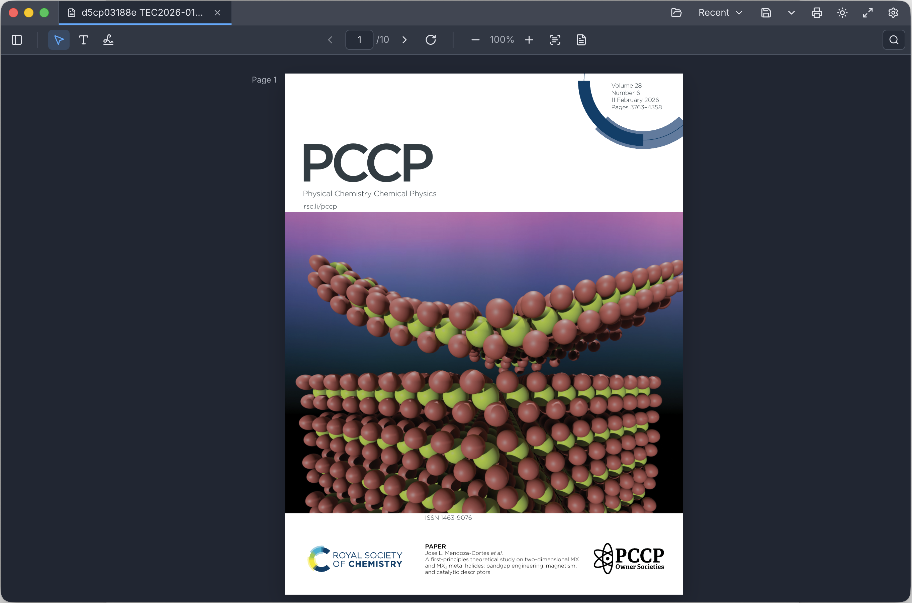

# MarkPDF

A standalone desktop PDF reader and lightweight editor, built with TypeScript, React, Electron, PDF.js, and pdf-lib. It aims to feel like a simplified, fast Acrobat-style viewer with a clean, Zed-inspired interface — without enterprise/legal PDF complexity.



## What It Is

MarkPDF is a cross-platform desktop application for opening, reading, lightly editing, annotating, and signing PDF documents. It runs fully on your machine — there is no server and your documents never leave your computer. It supports multiple documents at once through a tabbed interface and remembers per-document state (page, zoom, view mode, edits, and unsaved changes).

## Features

### Viewing
- Open local PDFs, including password-protected files.
- Multiple PDFs open at once as tabs.
- Drag and drop PDFs to open them in new tabs.
- Recent files menu.
- Single-page, two-page, and continuous-scrolling view modes.
- Page navigation: previous/next, direct page-number input, and total page count.
- Zoom in/out, actual size, fit page, fit width, fit height.
- Rotate the page view.
- Full-screen mode.
- Thumbnail sidebar and bookmarks/outline sidebar.
- Light and dark themes with a theme switcher; defaults to the OS theme on first launch and remembers your choice.
- Keyboard shortcuts for navigation, zoom, find, save, undo/redo, and escape-to-select.

### Editing & Annotation
- Add, move, resize, edit, and delete text overlays (with font-size control).
- Highlight selected text.
- Add pinned comments from selected text; edit and delete them.
- Comments and highlights are saved as standard PDF annotations, viewable in other Acrobat-compatible readers.
- Undo/redo support.

### Forms
- Detect fillable PDF form fields.
- Fill text fields, checkboxes, radio groups, and dropdowns.
- Form values are preserved in saved and exported PDFs.

### Signing
- Draw a signature with mouse/trackpad, type it as text, or upload a signature image.
- Place, move, and resize visual signatures on the page.

> Note: signatures are *visual* only — MarkPDF does not provide certificate-backed digital signatures, identity verification, or legal/compliance guarantees.

### Saving, Exporting & Printing
- Save, save as a new file, and export a flattened PDF.
- Print the current PDF with overlays, form values, and signatures included.
- Unsaved-change prompts when closing a modified tab or quitting.

### Additional Capabilities
- Text search with match navigation.
- OCR and semantic search support.
- Markdown preview and document-to-Markdown conversion.
- Local AI provider settings.

## Tech Stack

- **TypeScript** + **React 19** for the UI.
- **Electron** for the desktop shell.
- **PDF.js** (`pdfjs-dist`) for rendering.
- **pdf-lib** for editing, annotations, forms, and export.
- **Vite** for bundling, **electron-builder** for packaging.

## Development

```bash
npm install
npm run dev
```

## Build

```bash
npm run build
```

## Packaging

```bash
npm run package   # unpacked app directory
npm run dist      # distributable installer
```

## License and Rights

MarkPDF source code is licensed under the Apache License, Version 2.0. See [LICENSE](LICENSE).

The MarkPDF name, logo, icons, product identity, and associated branding are **not**
licensed under Apache-2.0. See [NOTICE](NOTICE) and [TRADEMARKS.md](TRADEMARKS.md).

Third-party package notices are listed in [THIRD_PARTY_NOTICES.md](THIRD_PARTY_NOTICES.md).

## Contributing

Contributions are accepted under Apache-2.0. See [CONTRIBUTING.md](CONTRIBUTING.md).
