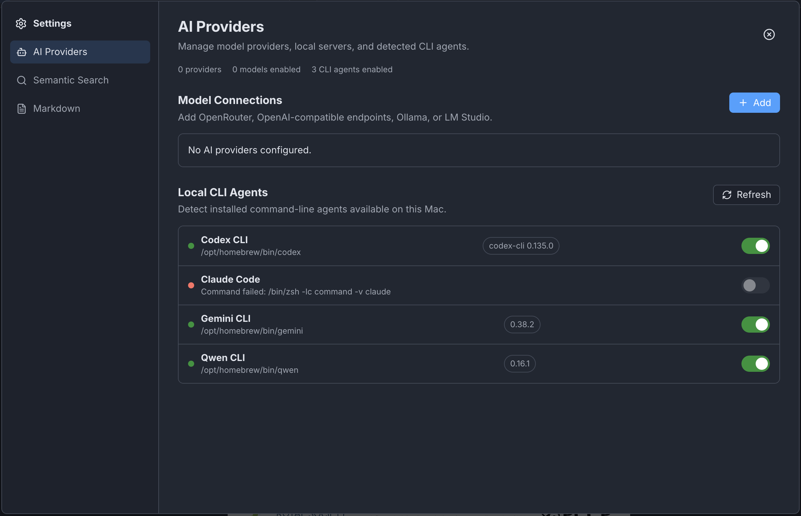
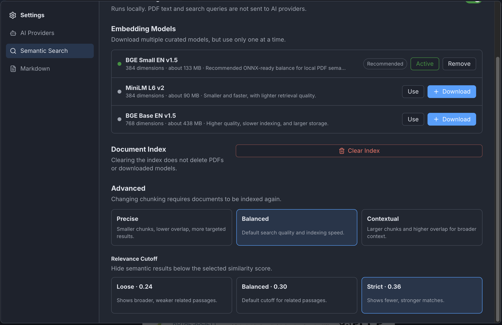

# MarkPDF

An open-source, minimalistic, standalone PDF and Markdown reader that puts the features usually locked behind paywalls (editing PDFs, annotating, and signing) — into a free, local-first desktop app with advanced AI features.


## Features

On top of typical pdf reader features (view, rotate, zoom etc.) the app contains the following capabilities:

### Cleanup

- The app is minimalistic by design and thus majority of junk present in your standard PDF reader is gone

### AI 

- Autodetection of all your CLI agents
- Connect any LLM provider (remote or local)
- Semantic search in your file (type keyward and press enter to see the results)







### Typically behind paywall features
- OCR conversion
- Group of images to PDF conversion
- Edit PDF (for now just page ordering)

### Viewing
- Light and dark themes with a theme switcher; defaults to the OS theme on first launch and remembers your choice.

### Editing & Annotation
- Add, move, resize, edit, and delete text overlays (with font-size control).
- Highlight selected text.
- Add pinned comments from selected text; edit and delete them.
- Comments and highlights are saved as standard PDF annotations, viewable in other Acrobat-compatible readers.

### Forms
- Detect fillable PDF form fields.
- Fill text fields, checkboxes, radio groups, and dropdowns.
- Form values are preserved in saved and exported PDFs.

### Signing
- Draw a signature with mouse/trackpad, type it as text, or upload a signature image.
- Place, move, and resize visual signatures on the page.

> Note: signatures are *visual* only — MarkPDF does not provide certificate-backed digital signatures, identity verification, or legal/compliance guarantees yet.


## Vision

I am at the very early stage of what this app should be, but so far I see it as:

1. Free, open-source alternative to paid alternatives
3. PDF/Markdown viewer with advanced AI features for humans and AI agents.
3. Minimalistic design
4. Extensible with community plugins (just like Obsidian is)
5. Not a "chat with pdf" app - you have your favorite chatbot for that (though possible via plugins in future - see below)

## Roadmap & Ideas

Looking for people who want to contribute to codebase and bring it to next level. Thus far, these are my ideas:

1. Plugin interface - to enable community building easily on top of the core (just like in Obsidian)
2. Signature interface - Bring Your Own Key (BYOK) for any signature provider - to remove vendor lock-in like the one in traditial PDF reader 
3. Expose as MCP/CLI (plus a Skill.md) for pdf-to-markdown and image-to-pdf conversions - to have a fixed realiable tool for this task
4. Discussion interface for AI agents - read your PDF and discuss with multiple AI agents
5. Obsidian plugin - read and discuss with agents in MarkPDF, save conclusions in Obsidian/MD file.
6. Make semantic search state-of-the-art - I just did the basic one, good but not great
6. Make OCR state of the art - handling images is missing

and anything else you think we should implement to make it awesome.

## Tech Stack

- **TypeScript** + **React 19** for the UI.
- **Electron** for the desktop shell.
- **PDF.js** (`pdfjs-dist`) for rendering.
- **pdf-lib** for editing, annotations, forms, and export.
- **Vite** for bundling, **electron-builder** for packaging.
- **Embeddings:** generated locally with [Transformers.js](https://github.com/huggingface/transformers.js) running ONNX models in-process. Curated models include **BGE Small EN v1.5** (384-dim), **MiniLM L6 v2** (384-dim), and **BGE Base EN v1.5** (768-dim). Embeddings use mean pooling with L2 normalization.
- **Vector store:** a local **SQLite** database (via `better-sqlite3`, with write-ahead logging) in the app's user-data directory, written from the main process so the `markpdf` command and the app share one index. Document text is chunked, embedded, and stored as Float32 vector blobs alongside their source page and heading path, with deduplication by content hash so re-opening a document doesn't re-index it.
- **Retrieval:** queries are embedded with the same model and ranked by **cosine similarity** against the stored chunk vectors, with a configurable score threshold (loose / balanced / strict) to tune precision vs. recall.
- **Tunable chunking:** precise, balanced, and contextual presets control chunk size and overlap to trade granularity against context.
- **Text extraction:** native PDF text where available, falling back to **Tesseract.js OCR** for scanned pages so even image-only PDFs become searchable.

## Command Line

MarkPDF ships a `markpdf` command that runs the same index, the same extractor and the same
embedding model as the application. Install it from **Settings › General › Command Line**.

```
markpdf index   <path...>  [--recursive] [--force]
markpdf search  <query>    (--path <pdf> | --id <hash>) [--top-k 12] [--min-score 0.3]
markpdf outline <path>     [--depth 3]
markpdf convert <path...>  [--pages 3-7] [--mode page-preserving|clean] [--out file.md]
```

Add `--json` to any of them for machine-readable output on standard output; progress and
diagnostics go to standard error, so the two never mix.

**It starts with no permission to read anything.** Grant a folder once and it is remembered:

```
markpdf --allow-read ~/Papers
markpdf --allow-write ~/Notes      # separate: reading never implies writing
markpdf --revoke-read ~/Papers     # and withdrawing a folder withdraws everything inside it
```

Run it on a terminal and it offers the grant with a single keystroke. Run it from a script and it
never prompts: it exits 5 and prints the exact command that would grant what it needed. A document
that is already indexed can still be searched after you withdraw the folder, because that answer
comes from the index and never opens the file.

Scanned pages are read with OCR, entirely offline — the language data ships with the application.

Exit codes: `0` success, including an empty search result. `1` an unexpected failure, `2` usage,
`3` not found, `4` not indexed, `5` access denied, `6` could not be read as a PDF, `7` some of a
batch failed, `8` a bundled dependency is missing, `9` the index is busy, `69` MarkPDF itself
could not be found or run, `130` interrupted.

## MCP Server

MarkPDF also speaks the Model Context Protocol, so an assistant that supports MCP can read your
documents directly instead of shelling out to the command. It is the same index, the same
extractor and the same permissions — an MCP client is another way in, not another set of rules.

Register it once with your client. For Claude Code:

```
claude mcp add markpdf -e ELECTRON_RUN_AS_NODE=1 -- \
  /Applications/MarkPDF.app/Contents/MacOS/MarkPDF \
  /Applications/MarkPDF.app/Contents/Resources/app.asar/dist-mcp/main.js
```

`ELECTRON_RUN_AS_NODE=1` is part of the registration, not something to set afterwards: without it
that binary opens the application window instead of running the server. For a client that reads a
JSON configuration file, the same three things — that binary as `command`, that script as the only
entry in `args`, and `ELECTRON_RUN_AS_NODE=1` in `env`. Add `MARKPDF_DATA_DIR` there too if you
keep your index somewhere other than the default.

Four tools, and no more:

| Tool | What it does | What it needs |
| --- | --- | --- |
| `outline` | The heading tree with page numbers, the page count, and whether the document has a text layer | Nothing, if the document is indexed; otherwise permission to read it |
| `search` | The passages of one indexed document that answer a question, each with its page and headings | Nothing — it reads the index and never opens the file |
| `read_pages` | The text of specific pages, which is how you get from a search hit to the material around it | Nothing — index only |
| `to_markdown` | The document as Markdown, or written to a file | Permission to read it, and separately to write, if you give `output_path` |

Each tool names one document, by `path` or by `id` — the content hash another tool returned —
never both.

**No tool indexes, grants or forgets anything.** Permission is given at a terminal with
`markpdf --allow-read`, where a person is present; an assistant cannot widen its own access. Index
your library first, and `search` and `read_pages` then work whether or not the grant is still in
place, because the answer comes from the index.

Every reply is bounded, and says so: if a document is longer than one answer can carry you are
told how much was left out rather than handed a shortened one that reads as complete.

## Development

```bash
npm install
npm run dev
```

## Build

```bash
npm run build
```

## Packaging

```bash
npm run package   # unpacked app directory
npm run dist      # distributable installer
npm run dist:mac  # macOS DMG and ZIP for the current architecture
```

## Release

The public download channel is GitHub Releases:

- Latest release page: https://github.com/cwik-tech/MarkPDF/releases/latest
- Direct latest Apple Silicon download: https://github.com/cwik-tech/MarkPDF/releases/latest/download/MarkPDF-mac-arm64.dmg

Before publishing macOS releases, add these GitHub Actions secrets:

- `MAC_CSC_LINK`: base64-encoded Apple Developer ID Application `.p12` certificate.
- `MAC_CSC_KEY_PASSWORD`: certificate password.
- `MAC_CSC_NAME`: Developer ID Application signing identity qualifier without the `Developer ID Application:` prefix.
- `APPLE_ID`: Apple ID used for notarization.
- `APPLE_APP_SPECIFIC_PASSWORD`: app-specific Apple ID password.
- `APPLE_TEAM_ID`: Apple Developer Team ID.

To publish a release, update `package.json` version, commit the change, tag the same version with a `v` prefix, and push the tag:

```bash
git tag v0.1.0
git push origin main --tags
```

The release workflow builds an Apple Silicon macOS DMG and ZIP on a native runner, signs and notarizes them, then uploads them to the GitHub Release for the pushed tag. MarkPDF requires an Apple Silicon Mac.

## License and Rights

MarkPDF source code is licensed under the Apache License, Version 2.0. See [LICENSE](LICENSE).

The MarkPDF name, logo, icons, product identity, and associated branding are **not**
licensed under Apache-2.0. See [NOTICE](NOTICE) and [TRADEMARKS.md](TRADEMARKS.md).

Third-party package notices are listed in [THIRD_PARTY_NOTICES.md](THIRD_PARTY_NOTICES.md).

## Contributing

Contributions are accepted under Apache-2.0. See [CONTRIBUTING.md](CONTRIBUTING.md).
